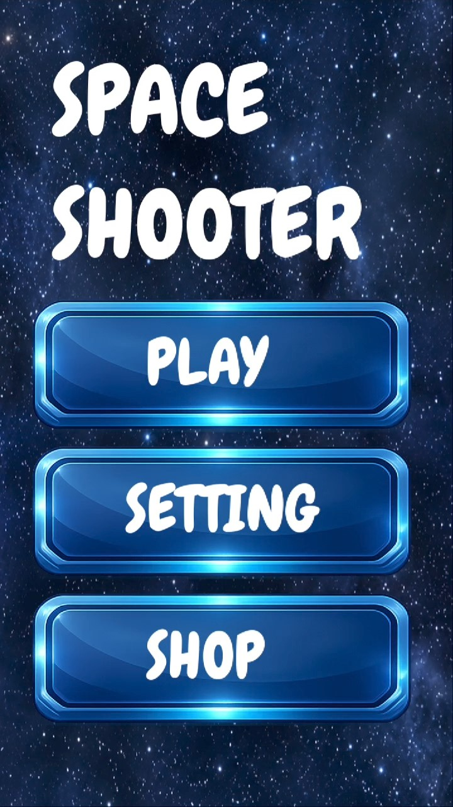
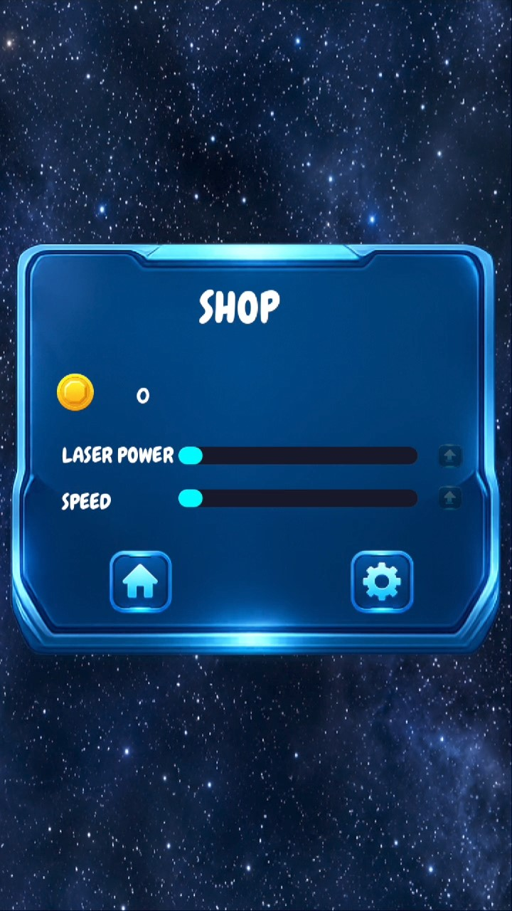
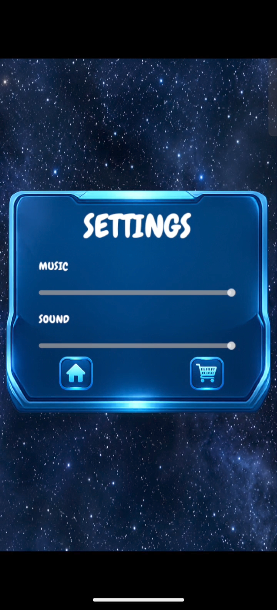
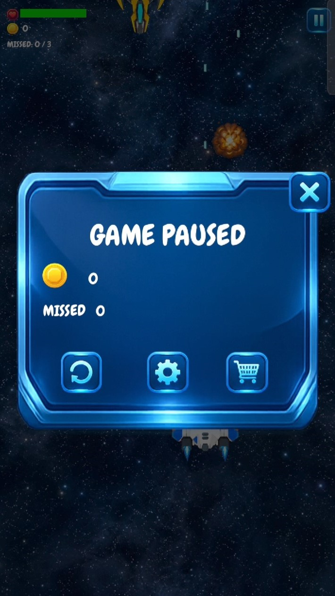
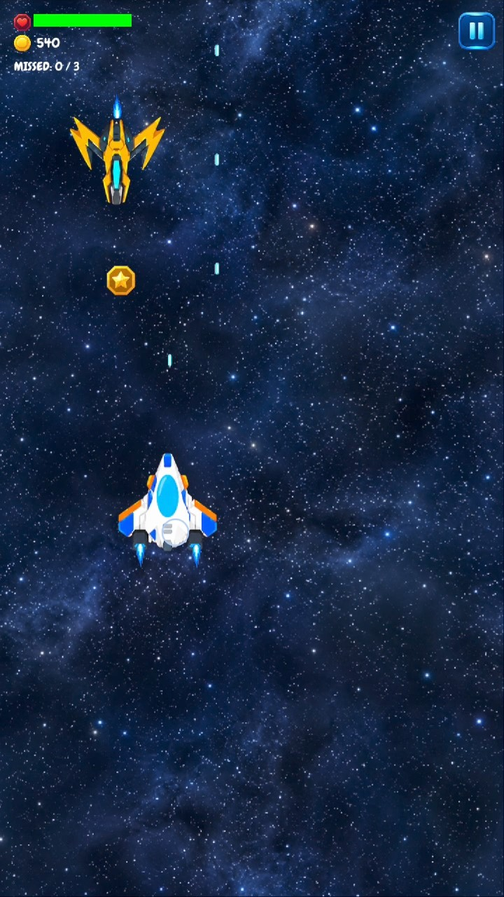

# Space Shooter: Ultimate Cosmic Warfare

Welcome to the definitive documentation for **Space Shooter** — a high-octane, action-packed 2D arcade space defense game built with cutting-edge performance in mind. Take command of the battle cruiser **Alpha Prime**, dodge relentless waves of hostile galactic forces, manage dynamic power-ups, and fight through 11 escalating planetary sectors!

  

---

## Deep Lore & Game Premise

Deep within Sector 11, an unknown cosmic anomaly has awakened ancient mechanized armadas and volatile space hazards. As the lone vanguard pilot of the starship **Alpha Prime**, you are tasked with defending human outposts across 11 distinct planetary sectors. 

With every sector you conquer, environmental conditions alter, enemy formations grow more aggressive, and cosmic hazards intensify. Armed with upgraded energy lasers, adaptive force shields, and high-tech utility power-ups, you must fight through relentless swarms, dodge devastating asteroid belts, and eliminate colossal Mega Bosses to restore galactic balance.

---

## Complete User Interface & Scene Architecture

The game's front-end architecture is engineered to provide smooth, cinematic visual transitions paired with reactive UI responsiveness across all screen resolutions.

* **Main Home Menu (Hub):**
  * Features high-resolution animated space backgrounds with interactive UI buttons.
  * Equipped with custom UI tweening and spring physics for button hover and press events.
  * Seamless black screen fade-in and fade-out transition system managed by dynamic canvas layers.
* **In-Game Upgrade Shop:**
  * Persistent economy system tracking gathered cosmic gold coins across runs.
  * Direct ship stat upgrades including **Main Laser Base Damage**, **Engine Maneuverability Speed**, and **Hull Fortification (Max HP)**.
  * Real-time level indicators showing current upgrade ranks and coin requirements.
* **Settings & Audio Controls:**
  * Audio Bus integration for independent volume adjustments of Background Music (BGM) and Sound Effects (SFX).
  * Instant graphics and control response preferences.
* **Heads-Up Display (HUD) & Pause System:**
  * Dynamic player health gauge with real-time value smoothing.
  * Active Power-Up progress bars displaying active timer durations and multiplier stack levels.

  
  
  

---

## Specialized Control Scheme

The flight systems of **Alpha Prime** are specifically calibrated for precision and accessibility. WASD controls are strictly disabled to prevent key-conflict issues, leaving three precise input modes:

1. **Touch Drag Controls (Mobile / Tablets):**
   * Direct touch-and-drag mechanics with adaptive origin offset.
   * Auto-fires lasers continuously while maintaining 1:1 finger tracking precision across screen borders.
2. **Mouse Motion Tracking (Desktop):**
   * Smooth mouse drag pointer response allowing quick reflex evasions.
3. **Keyboard Directional Arrows (Classic Arcade):**
   * **Up Arrow:** Move Forward / Upward
   * **Down Arrow:** Move Reverse / Backward
   * **Left Arrow:** Strafe Left
   * **Right Arrow:** Strafe Right

> **Note on Weapons:** Auto-firing primary laser technology is enabled by default across all control modes, letting you focus entirely on spatial awareness, evasive maneuvers, and power-up tactical collection.

---

## Enemy Types & Threat Intelligence

Hostile entities in Space Shooter fall into four distinct operational classes, each requiring unique combat responses:

  
  

### 1. Standard Vanguard Fighters
* **Behavior:** Enter from the top of the screen and fly strictly in **straight downward vectors**.
* **Threat Level:** Low.
* **Tactics:** Ideal targets for early coin harvesting. Straight alignment makes them easily destroyable with standard single-laser fire.

### 2. Volatile Asteroid Fields
* **Behavior:** Dense space rocks drifting downward at varying rotational speeds and velocities.
* **Threat Level:** Medium.
* **Tactics:** High structural integrity. Requires sustained laser fire to shatter before impact. Direct collision causes severe hull damage to unshielded ships.

### 3. Track-and-Destroy Zigzag Raiders
* **Behavior:** Highly aggressive enemy units equipped with dynamic player-tracking algorithms. They maneuver horizontally in erratic **zigzag patterns while tracking the player's exact X-axis position** to force a kamikaze collision.
* **Threat Level:** High.
* **Tactics:** Do not stay in one spot! Continuous lateral movement is required to break their tracking vector. In collisions without an active shield, they trigger instant mutual destruction.

### 4. Sector Mega Bosses
* **Behavior:** Massive war machines appearing at key sector milestones. Possess massive health pools, dynamic multi-stage bullet-hell attack phases, targeted laser barrages, and escort swarms.
* **Threat Level:** Critical.
* **Tactics:** Utilize high-tier power-ups (such as Quantum Slow Motion and Purple Crystal Overcharge) to evade dense bullet patterns while focusing fire on primary boss core modules.

---

## Dynamic Power-Up Matrix

Power-ups spawn dynamically throughout battle, offering immediate tactical advantages. Each power-up can be upgraded up to **Stack Level 5**:

| Power-Up | Icon Symbol | Tactical Effect & Stack Mechanics |
| :--- | :--- | :--- |
| **Cosmic Magnet** | Magnet | Creates a forcefield pulling all screen coins directly to the ship. Level increases pull radius and active time. |
| **Energy Shield** | Shield | Grants total invulnerability to collisions and laser fire while regenerating +15 HP per active level stack. |
| **Rapid Fire** | Energy | Overcharges cannon capacitors to drastically reduce fire delay down to extreme sub-millisecond speeds. |
| **Star Triple-Shot** | Star | Converts single laser fire into spreading multi-barrel beams (up to 5 paired side barrels at Max Level). |
| **Purple Crystal** | Crystal | Unlocks hyper-dense multi-beam laser patterns with custom high-damage rainbow projectile textures. |
| **Quantum Clock** | Clock | Manipulates space-time to slow all enemy movement, asteroids, and enemy projectiles by up to 70%. |
| **Nano Repair** | Hull HP | Instantly restores lost health points and permanently expands maximum ship hull structural integrity for the run. |

---

## The 11 Planetary Levels Progression System

Space Shooter features an immersive **11-Level Progression System**. Passing each level changes the operational environment, screen visuals, hazard density, and combat mechanics:

### Level 1: Deep Space Outpost
* **Theme:** Open quiet space with distant nebulae.
* **Mechanics:** Intro level featuring low-density Standard Straight Enemies. Designed for mastering touch/keyboard arrow controls.

### Level 2: Asteroid Belt Entry
* **Theme:** Dense grey rock formations.
* **Mechanics:** Introduction of volatile Asteroids drifting alongside standard fighters. Requires rapid targeted firing.

### Level 3: The Zigzag Swarm
* **Theme:** Crimson solar flare environment.
* **Mechanics:** Zigzag Raiders make their first appearance. Player tracking begins, requiring heavy evasive maneuvers.

### Level 4: First Mega Boss Encounter
* **Theme:** Orbital Starbase Ruins.
* **Mechanics:** Sector 1 Mega Boss battle. Standard waves halt; players must dodge multi-directional laser patterns and destroy the boss core.

### Level 5: Cosmic Dust Storm
* **Theme:** Reduced visibility with glowing purple dust clouds.
* **Mechanics:** Enemy speeds increase by 25%. Magnet and Rapid Fire power-up drop rates are boosted to balance high-speed swarms.

### Level 6: Combined Arms Warfare
* **Theme:** Deep void with shifting green aurora.
* **Mechanics:** Standard Fighters, Asteroids, and Zigzag Raiders spawn simultaneously in mixed tactical waves.

### Level 7: Solar Flare Acceleration
* **Theme:** Bright orange star surface backdrop.
* **Mechanics:** Environmental heat increases global speed. Player baseline speed and enemy projectile velocities are increased by 40%.

### Level 8: Elite Vanguard Defense
* **Theme:** Enemy fleet mothership perimeter.
* **Mechanics:** High-health armored enemy variants replace standard fighters. Requires laser damage upgrades from the Shop.

### Level 9: Quantum Anomaly
* **Theme:** Distortion space-time grid visuals.
* **Mechanics:** Random slow-motion and fast-forward space warps occur naturally during waves. Time-management becomes key.

### Level 10: The Twin Mega Bosses
* **Theme:** Deep Sector Command Citadel.
* **Mechanics:** Dual-boss encounter. Two heavily shielded flagship commanders attack simultaneously with crossfire laser beams.

### Level 11: Galactic Core Final Showdown
* **Theme:** Hyper-drive warp zone with dynamic speed lines.
* **Mechanics:** The ultimate test. Maximum spawn rates of Zigzag Raiders, giant Asteroids, relentless elite waves, culminating in the final Supreme Commander Boss fight.

---

## Ship Upgrades & Economy Guide

Coins collected during gameplay are stored permanently in your player profile. Spend them wisely in the **In-Game Shop** between runs:

1. **Laser Base Damage:**
   * Level 1 Base: `1.0x` Multiplier
   * Upgrade Increment: `+0.5x` Damage per level
   * Essential for shredding high-level Mega Bosses and heavy Asteroids.
2. **Engine Thruster Speed:**
   * Level 1 Base: `500.0` units/sec
   * Upgrade Increment: `+55.0` speed units per level
   * Crucial for dodging fast Zigzag Raider tracking paths in later sectors.
3. **Hull Fortification (Max Health):**
   * Level 1 Base: `100.0` HP
   * Upgrade Increment: `+25.0` HP per level
   * Expands the safety buffer against heavy projectile hits.

---

## Audio Engineering & Visual Dynamics

* **Dynamic Audio Mixer:** Separate audio buses (`BGM` and `SFX`) ensure crisp explosion sounds without ducking background music quality.
* **Particle Physics Engine:**
  * Dual animated thruster particles connected to ship engine markers.
  * Explosion scenes with scaling particle lifetime and directional debris velocity.
* **Collision Matrix Safety:** Built-in micro-invulnerability timers prevent damage bleed-through bugs, ensuring accurate collision hitboxes for lasers, player hulls, and enemy boundaries.

---

## Technical Engine Specifications

* **Engine:** Godot Engine 4.x
* **Render Pipeline:** Forward+ / Compatibility Mode for Web
* **Language:** GDScript 2.0
* **Target Aspect Ratio:** 16:9 Arcade Portrait & Landscape Responsive
* **Physics Mode:** Area2D Precision Overlap & Signal Detection
